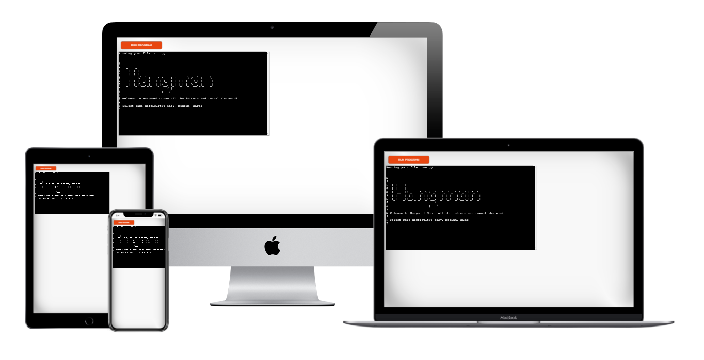
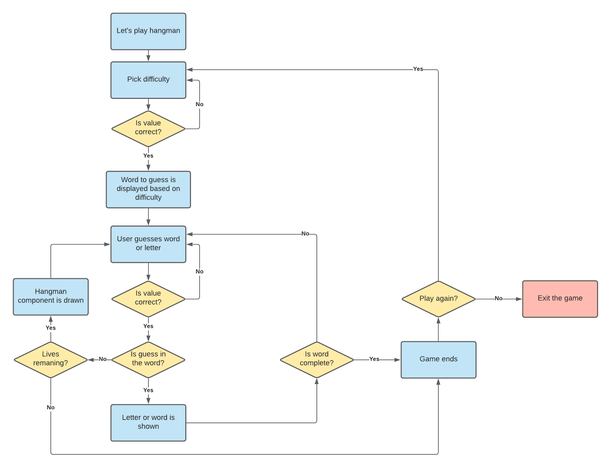
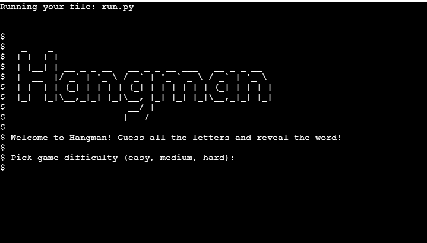
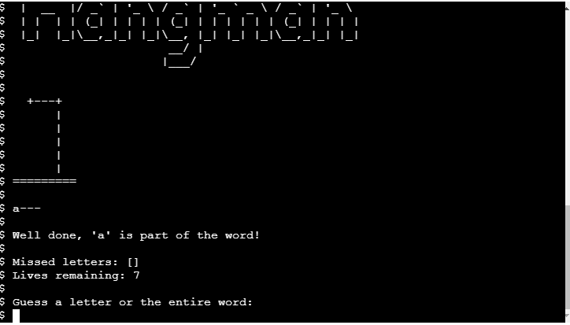
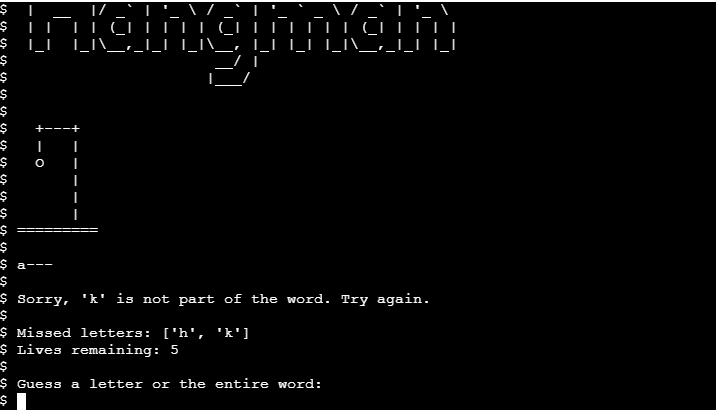
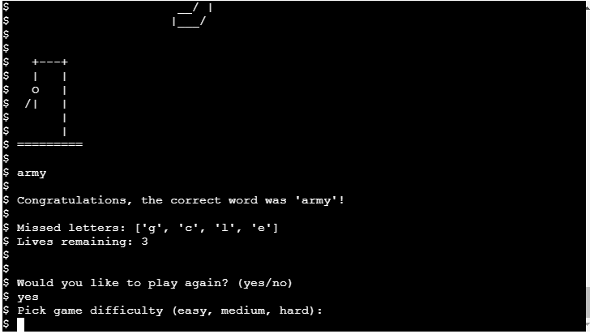
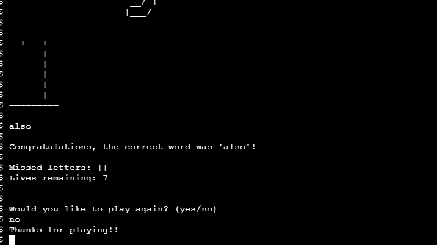

# Hangman

Hangman is a Python terminal game that runs on Code Institute mock terminal on Heroku.

This classic game will bring you back in time, to when we used to play it on paper.

[View deployed site here](https://paolas-hangman.herokuapp.com/)

## How to play

The aim of the game is to guess the hidden word. The word to guess is represented by a row of dashes, each one replacing a letter of the word. 

With each turn the player can either guess the entire word or a letter. If the guess is correct, the dashes will be replaced with the guessed letters. 

The player has 7 lives. With each incorrect guess, one life is subtracted and one element of the hangman stick figure is drawn. 

The game ends when either the player guesses the word or no more lives remain. 

You can read more on the hangman game [here](https://en.wikipedia.org/wiki/Hangman_(game)).

## Game Diagram

I have created the following diagram to help me visualise how the game would work and the necessary steps to take.

## Features 

### Existing Features

1. Game difficulty selection

    - The user can select the difficulty for the game: easy, medium or hard. 

    - Based on the difficulty option selected, a random word is retrieved.

    - Easy words will have 4 characters, medium will have 6 and hard will have 8 characters.

    

2. Hangman image and hidden word

    - After the difficulty is selected, the player is presented with the word hidden by dashes, each letter is represented by a dash. 

    - The first hangman image shown is the woodwork, with each incorrect guess, the image will change, adding a component of the hangman figure. 

3. Feedback message 

    - After each guess, just below the hidden word, the player is presented with a message that lets them know that the guess is incorrect or congratulates the user when the guess is correct.

    - The message also lets the user know if the input is invalid or if the letter was already guessed.

    

4. Incorrect guesses and lives 

    - At each point of the game the player is presented with the number of lives remaning (7 lives in total).

    - The user can also see their incorrect guesses. Incorrect letters will be shown as "Missed letters".

    

5. Prompt for new game

    - At the end of each game, the player is asked if they wish to play again. If the answer is yes, the user is prompted to select the game difficulty again. If the answer is no, the user is presented with a thank you message and the program ends. 

    

    

6. Input validation 

    - Each user input is validated, feedback is returned to the user, whether the input is invalid, the guess is correct or incorrect, or whether the letter was already guessed and therefore to try with a different one. 

### Features to Implement in future

1. As a future feature, it would be nice to also show the user a list of incorrect words guessed other than only the incorrect letters. At the moment if the user guesses an entire word and the guess is incorrect, a life is correctly subtracted, but the user won't be able to see all the incorrect guesses (for entire word).

2. I would also like to add a scoreboard where the player can see their scores. 

3. Add additional words for each game difficulty level, and maybe add different categories for the words to pick from (movies, nature, food, etc.)

## Technologies Used

- This project was developed using Python programming language.

- Textkool: I have used [Textkool](https://textkool.com/en/ascii-art-generator?hl=default&vl=default&font=Red%20Phoenix&text=Your%20text%20here%20) to create the title for the game.

## Testing

The game has been thoroughly tested by following these steps:

- Enter incorrect input for game difficulty, or simply click enter, and verify that a message is returned that advises the player to use one of the valid options. 

- Enter game difficulty and make sure that the hidden word is displayed correctly: 4 character word for the easy level (4 dashes), 6 characters for the medium level (6 dashes) and 8 characters for the hard level (8 dashes).

- Make sure that the first image shown after selecting the difficulty level is the woodwork. 

- When guessing the letter/word, enter an invalid input (anything that is not a letter), or click enter, and verify that a message is returned that advises the user to use a valid input.

- When guessing a letter and the guess is correct: 

    - Make sure that the letter replaces the dash.

    - Make sure that multiple dashes are replaced if the letter is in the word multiple times.

    - Check that no lives are subtracted and that the correct letter is not added to the "Missed letters" list. 

    - Ensure that the correct feedback message is returned to the user letting them know that their guess was correct. 

    - If the letter was already guessed, make sure a message is returned to the user advising to try again. 

- When guessing a letter and the guess is incorrect: 

    - Check that a life is correctly subtracted after each incorrect guess.

    - Ensure that the image changes to show the correct next component of the hangman figure. 

    - Ensure that the incorrect letter is added to the "Missed letters" list. 

    - Make sure that the correct feedback message is returned to the user letting them know that the letter is not in the word. 

    - If the letter was already guessed, make sure a message is returned to the user advising to try again. 

- When guessing the entire word and the guess is incorrect, make sure that a life is subtracted and that the image changes with the additional component of the hangman figure. 

- When the user has no more lives remaining, verify that:

    - Correct feedback message is shown to let them know what the correct word was.

    - Complete hangman stick figure is drawn.  

    - User is presented with the option to start a new game. 

- When the user guesses the word correctly, either with single guesses or by guessing the entire word, verify that: 

    - Correct feedback message is shown to congratulate the user. 

    - User is presented with the option to start a new game.

- When prompted for a new game after the current one has ended, verify that: 

    - If an invalid input is used, or if the user simply click enter, make sure that a message is returned advising the user to enter a valid option. 

    - After entering "yes", the user is prompted to select the game difficulty again. Validate the same steps as above in relation to the game difficulty selection.

    - After entering "no", verify that a thank you message is returned.  

## Bugs

1. One of the main bugs I encountered was that the "guessed" list (containing all the correct guesses from the player) was not getting updated correctly in case of multiple occurrencies of the same letter in the word. The letter was only added once instead of multiple times. This resulted in the game not ending as expected when the player guessed all the letters, additional attempts were needed. 
Tutor Scott from Code Institute helped me by correcting my code for lines 63, 64 and 65, the for loop I wrote was incorrect and was causing the issue. 

2. Another bug I encountered was related incorrect message returned in the scenario where the user presses enter without entering a letter or word for their guess. This was taken care of by correcting line of code 101 and adding "guess.isalpha()".

3. The hangman stick figure was not being drawn correctly after the first incorrect guess. I then realised that my images.py file was actually missing one of the images for the game to work properly so I have added one (8 images as opposed to 7). 

4. A small bug was that the game title was not showing correctly on the emulator on Heroku while displaying correctly on the Gitpod terminal. I have replaced the title with one of a different format which is showing fine on Heroku. I have kept the original title in the images.py file ("hangmantitle") as I might want to go back to that in future. 

## Remaining bugs

1. This is not really a bug but more of a small issue on the mock terminal. While os.system("clear") in function show_status appears to be working with no issues in the Gitpod terminal, this is not working on the emulator on Heroku and the terminal is not cleared as it would be expected. This means that if you scroll up the page after your first input, you will see the previous commands.
Having said this, all the information is clearly visible on Heroku as well, the game functionality and player experience does not seem impacted, so I have decided that for now there is no immediate need to address this issue.   

## Validator Testing 

I have used [PEP8](http://pep8online.com/) to validate the Python code. 

There is only a warning (W503) for line 56, "line break before binary operator". 

I have read the following on this warning message and it is my understanding that this is not actually an issue: 

- https://www.python.org/dev/peps/pep-0008/#should-a-line-break-before-or-after-a-binary-operator

"In Python code, it is permissible to break before or after a binary operator, as long as the convention is consistent locally."

- https://www.flake8rules.com/rules/W503.html

"line breaks should occur before the binary operator because it keeps all operators aligned."

## Deployment

This project was developed using Gitpod editor and was deployed using Code Institute's mock terminal for Heorku.

### Cloning the repository

To clone the repository, follow these steps: 

1. Log into Github and locate the repository for this project: [Paola62010/hangman](https://github.com/Paola62010/hangman)
2. Above the list of files, click on _Code_, a dropdown menu is presented with different options.
3. In the Clone with HTTPs section, copy the clone URL for the repository.
4. In your local IDE open the terminal.
5. Change the current working directory to the location where you want the cloned directory to be. 
6. Type _git clone_, and then paste the URL copied earlier (step 3).
7. Press Enter to create your local clone.

Additional information on how to clone a Github repository can be found [here](https://docs.github.com/en/github/creating-cloning-and-archiving-repositories/cloning-a-repository).

### Deploying to Heroku

To deploy to Heroku follow these steps: 

1. Log into [Heroku](https://dashboard.heroku.com/apps) and locate the "New" button, on the top right end side of your dashboard page. 
2. Click on "Create new app", select your region and pick a name for your project. 
3. On top of the next page there is a navigation bar, select "Settings". 
4. In "Settings" add buildpacks Python and Node.js in this order. 
5. On the navigation bar on top of the page, select now "Deploy".
6. Select deployment method "Github" and seach for your repository. 
7. Proceed to link the Heroku app to the repository by clicking on "Connect". 
8. Click on Deploy.

## Credits

- I have taken part of the code from the below stackoverflow page to resolve an issue I was having with replacing the dashes in the hidden word with the guessed letters: 

https://stackoverflow.com/questions/61964490/how-to-replace-dash-with-letter-hangman

- Lines of code 63, 64 and 65 were provided by tutor Scott from Code Institute. Thank you Scott for helping me on this. The issue I was having was that the guessed letters were not being added correctly to the "guessed" list in case of multiple occurrencies of the same letter in the word. 

- I have taken the images for the hangman stick figure from the following github page: 

https://gist.github.com/chrishorton/8510732aa9a80a03c829b09f12e20d9c

- Code Institute for the deployment terminal. 

- [Wikipedia](https://www.wikipedia.org/) for the details of the hangman game.  

### Acknowledgements

Thank you to Code Institute and the tutors for putting up with my questions and pointing me in the right direction. A special thank you to tutor Scott. 